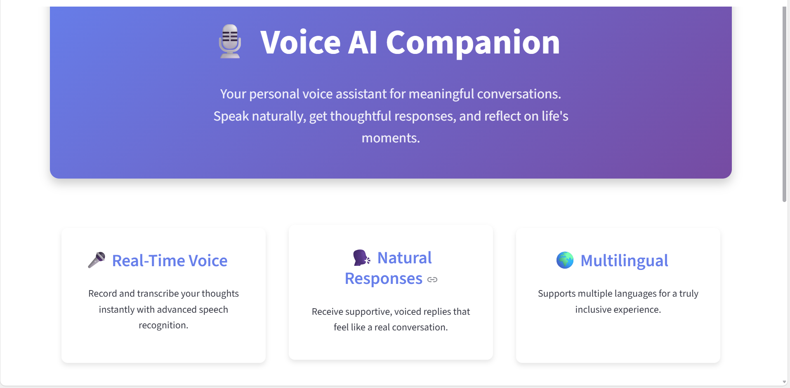

# 🎙️ Voice AI Companion with Murf Falcon TTS, Python ASR, and Streamlit

A modular, demo-ready agent that records speech, transcribes it, generates supportive replies, and speaks them back via **Murf Falcon TTS**.  
Built for competitions: clean architecture, clear documentation, and compelling UX.

---

## 🚀 Features
- 🎤 Real-time mic capture and ASR (SpeechRecognition + Google backend)
- 🧠 Responsive, humane replies (rule-based + optional OpenAI LLM)
- 🗣️ Murf Falcon TTS synthesis with configurable voice ID
- 📝 Conversation memory and transcript log
- 🌐 Streamlit UI with language and voice controls

---

## 🧩 Architecture
User → ASR → Agent (+Memory) → TTS → Audio

- Swap ASR: Python mic (now) → Falcon ASR (future)  
- Swap TTS: synchronous (now) → streaming (future)  
- Swap replies: rule-based (now) → LLM (OpenAI/Hugging Face)  

---

## 🛠️ Setup

### 1. Install Python
Make sure you have **Python 3.10+** installed.

### 2. Create a virtual environment

python -m venv .venv
.venv\Scripts\Activate.ps

### 3. Install Dependencies
pip install -r requirements.txt

### 4. Add environment variables
Create a file named .env in the project root:
OPENAI_API_KEY=sk-your-openai-key
MURF_API_KEY=your-murf-api-key
MURF_VOICE_ID=Arohi
DEFAULT_LANGUAGE=en-IN

### 5. Run the app
streamlit run app.py

## 📸 Screenshots

Here’s what the app looks like:

